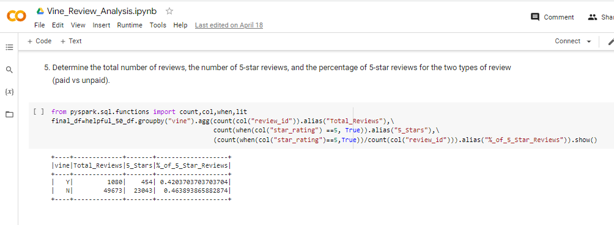

# Amazon_Vine_Analysis

## Overview of the analysis

This analysis was performed using Pyspark on Google CoLab, RDS on AWS, PGAdmin, as well as data retrieval from AWS S3 storage for the purposes of analyzing product review data by Amazong Vine members and non-Vine members.  The Electronics product segment was selected for this analysis from a list of 50.

## Results

The following questions are answered using the results shown in the final_df dataframe shown in **_Figure 1_** below.

1. How many Vine reviews and non-Vine reviews were there?  **There were 50,753 reviews**
2. How many Vine reviews were 5 stars? How many non-Vine reviews were 5 stars?  **There were 454 Vine 5-Star reviews and 23,043 non-Vine 5-Star reviews.**
4. What percentage of Vine reviews were 5 stars? What percentage of non-Vine reviews were 5 stars?  **Vine - 42% and non-Vine 46%**

**_Figure 1: Summary Results_**

## Summary 

The percentage of 5-star reviews for Vine and non-Vine members does not appear to show a positivity bias as shown in **_Figure 1_** above the outcome is 42% vs 46% respectively.  That said this analysis would be better served if more than just 5 star's were evaluated given a 4 star review is an equally positive review and could be included.  Furthermore, this dataset includes one product where there were 50 to choose from if an analysis were performed on the entire population of products the result could potentially be different.  

